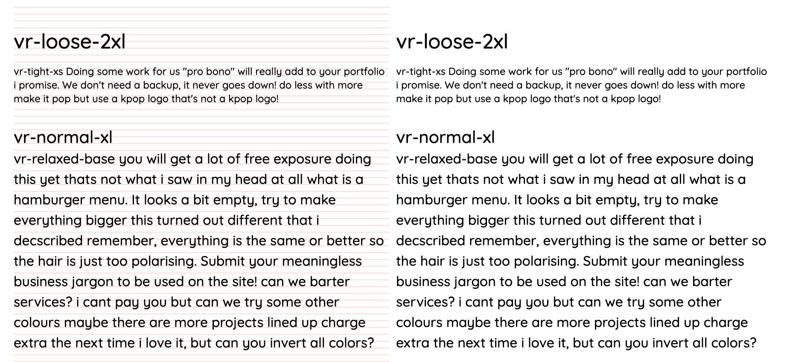

# Tailwind.css Vertical Rhythm
Beautifully aligned type with Tailwind.css.

### Install
```
npm install --save-dev tailwind-vertical-rhythm
```
&mdash;or&mdash;
```
yarn add -D tailwind-vertical-rhythm
```

### Configure tailwind.config.js

Use https://codepen.io/sebdesign/pen/EKmbGL?editors=0011 to calculate the cap
heights of your fonts.

```js
{
  // you can disable standard font size and line height classes and use vr-*
  // classes instead
  corePlugins: {
    fontSize: false,
    lineHeight: false
  },
  verticalRhythm: {
    defaultLineHeight: 'loose',
    fontCapHeight: {
      // Calculated using https://codepen.io/sebdesign/pen/EKmbGL?editors=0011
      'default': 0.705,
      'Open Sans': 0.72
    },
    height: 0.5 // Vertical rhythm in rems
  },
  plugins: [
    require('tailwind-vertical-rhythm')
  ]
}
```

And now use `.vr{-fontFamily?}-{lineHeight}-{fontSize}` classes to set line height,
font size, and possibly non-default font family at the same time.

Also, there&rsquo;s a `.vr-debug` class showing the vertical rhythm to see where
you&rsquo;re not aligned.

Based on https://github.com/ceteio/styled-components-rhythm
